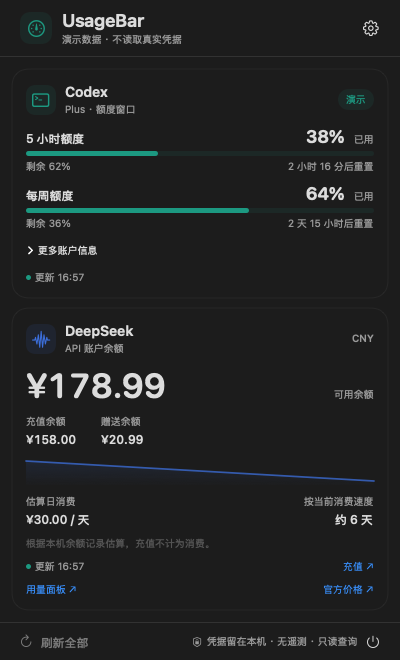

# UsageBar

一个原生 macOS 菜单栏工具，用来查看 Codex 额度和 DeepSeek 人民币余额。使用 SwiftUI / AppKit 开发，无第三方运行时依赖。

菜单栏示例：

```text
C 12%  ·  D ¥16.34
```

`C` 表示 Codex 额度使用比例，取接口返回的额度窗口中的最高值；`D` 表示 DeepSeek 的 CNY 余额。点击菜单栏图标可查看详情，右键可刷新、打开设置或退出。

## 界面预览

下图使用演示数据，不代表真实账户。



[浅色面板](docs/images/dashboard-light.png) · [未连接状态](docs/images/dashboard-unconnected.png) · [设置界面](docs/images/settings.png)

## 功能

| 模块 | 功能 |
| --- | --- |
| Codex | 查看已用比例、剩余额度、重置时间；展开查看接口提供的附加额度、积分和预算信息 |
| Codex 数据源 | 复用本机 OAuth 登录查询；查询失败时回退到本地会话快照；支持仅使用离线数据 |
| DeepSeek | 仅显示人民币 CNY 总余额、充值余额和赠送余额 |
| 消费估算 | 根据本机余额记录绘制变化曲线，估算日消费和剩余可用天数 |
| 提醒 | 自定义 CNY 余额阈值；在线 Codex 额度使用达到 90% 时提醒；通知默认关闭 |
| 桌面体验 | 深浅色跟随系统、登录时自动启动、菜单栏仅显示图标、独立刷新间隔 |

主面板根据内容调整高度。应用常驻菜单栏，不显示 Dock 图标；关闭设置窗口后仍会运行。

## 安装与启动

项目部署目标为 **macOS 13 及以上**，通用构建包含 **Apple Silicon（arm64）和 Intel（x86_64）** 两种架构。实际验证范围见下方说明。

解压发布者提供的 `UsageBar-macOS.zip`，将 `UsageBar.app` 拖入「应用程序」目录，双击启动，也可以运行：

```bash
open -a UsageBar
```

在源码目录完成构建后，可直接启动本地安装包：

```bash
open "dist/UsageBar.app"
```

更新应用时，先从菜单栏退出旧版，再打开新版。

默认构建使用本地 ad-hoc 签名，未进行 Apple 公证。公开分发时可使用自己的 Developer ID 签名并完成公证。

## 配置账户

### Codex

点击面板齿轮打开设置，确认「Codex 目录」指向本机已有的登录及会话数据目录。默认值取 `CODEX_HOME` 环境变量；未设置时使用 `~/.codex`。目录需要为绝对路径或以 `~/` 开头，修改后点击「应用」。

| 数据来源 | 行为 |
| --- | --- |
| 自动（在线优先） | 先查询在线额度，失败时读取本地会话 |
| 在线（失败时回退） | 先查询在线额度，同样支持失败后回退到本地会话 |
| 离线会话 | 只读取本地会话，不进行 Codex 网络查询 |

在线查询需要 `auth.json` 中已有的 OAuth 登录令牌；仅配置 API Key 的登录文件不适用。UsageBar 不提供登录流程，也不会刷新或改写令牌。

离线模式读取最近 7 天目录中的 `rollout-*.jsonl`，最多检查 64 个文件。离线额度是会话事件中的快照，可能落后于账户当前状态；目前不支持 `.jsonl.zst` 压缩会话。

### DeepSeek

1. 在设置中点击「获取密钥」，打开 [DeepSeek 密钥管理页面](https://platform.deepseek.com/api_keys)。
2. 在输入框按 `⌘V`，或点击旁边的「粘贴」按钮填入 API Key。
3. 点击「保存密钥」，应用将密钥写入 macOS 钥匙串并查询余额。

DeepSeek 模块固定显示 **人民币 CNY**，不提供 USD 切换，也不做汇率换算。接口没有返回 CNY 时会显示「接口未返回人民币余额」。

替换或删除密钥会清除旧账户的本地余额历史和提醒状态。保存或删除本地密钥不会修改 DeepSeek 平台上的密钥。

### 刷新与提醒

- Codex 默认每 1 分钟刷新，可选 30 秒、1 分钟、2 分钟或 5 分钟。
- DeepSeek 默认每 5 分钟刷新，可选 1、5、10 或 30 分钟。
- CNY 默认提醒阈值为 `75, 35, 7`，多个正数用英文逗号分隔，修改后点击「保存阈值」。
- 人民币余额低于 7 元时另有极低余额提示。
- 需要系统通知时，在「通用」中开启「余额和额度通知」，并允许 macOS 通知权限。

请求失败后会延长重试间隔，成功后恢复正常刷新。`~` 表示 Codex 使用离线快照，或该数据最近一次刷新失败、正在显示上次成功的结果；面板会显示具体状态和时间。

消费估算需要至少 30 分钟的余额记录，且存在余额下降。它根据下降金额估算消费，余额上涨不计为消费；不等同于官方账单。本地历史最多保留 14 天、每币种 500 条，新记录仅保存 CNY。点击「清除余额历史」后，曲线和估算会重新积累。

## 从源码构建

需要 macOS、Swift 工具链及 Xcode 或 Command Line Tools。`Package.swift` 声明 Swift tools 5.9；本次构建验证使用 Apple Swift 6.4。

在项目根目录执行：

```bash
# 构建当前 Mac 架构
scripts/build-app.sh

# 构建 Apple Silicon + Intel 通用安装包
scripts/build-app.sh --universal
```

输出文件：

```text
dist/
├── UsageBar.app
└── UsageBar-macOS.zip
```

构建脚本会生成图标、签名应用并验证签名。ZIP 同时包含项目许可证及第三方版权声明。

可通过环境变量指定构建缓存目录和签名身份：

```bash
USAGEBAR_BUILD_ROOT=/tmp/usagebar-build scripts/build-app.sh --universal

USAGEBAR_SIGN_IDENTITY="Developer ID Application: YOUR NAME (TEAMID)" \
  scripts/build-app.sh --universal
```

在受限构建环境中，若 SwiftPM 的嵌套沙盒无法启动，可使用：

```bash
USAGEBAR_BUILD_ROOT=/tmp/usagebar-build \
USAGEBAR_DISABLE_BUILD_SANDBOX=1 \
  scripts/build-app.sh --universal
```

该开关仅调整构建子进程，不改变应用的凭据存储或网络行为；当前打包脚本也会为此选择 SwiftPM 的原生构建后端。

## 测试与演示

运行离线回归检查：

```bash
scripts/test.sh
```

目前有 20 项检查，覆盖响应解析、金额精度、CNY 严格选择、旧配置兼容、会话读取、接口失败回退、消费估算及提醒去重。测试使用模拟请求和临时数据，不读取真实凭据，也不向真实账户发送请求。

无需配置账户即可查看演示窗口：

```bash
open -n "dist/UsageBar.app" --args --demo --show-window
```

演示模式使用固定样例，不执行账户查询，也不保存凭据、偏好设置或余额历史，不申请通知或修改登录项。

开发时还可以导出原生预览，或执行启动检查：

```bash
dist/UsageBar.app/Contents/MacOS/UsageBar --demo --export-preview /tmp/usagebar-previews
dist/UsageBar.app/Contents/MacOS/UsageBar --demo --smoke-test
```

## GitHub 构建与发布

[macOS 工作流](.github/workflows/macos.yml) 在代码推送或 Pull Request 时运行离线测试、构建通用应用，并上传名为 `UsageBar-macOS` 的构建附件。可在仓库的 Actions 页面下载；工作流不会自动发布 Release，也不需要配置账户 API Key。

源码提交应包含 `Sources/`、`Tests/`、`Resources/`、`scripts/`、`docs/`、`.github/`，以及根目录的包配置、README、`.gitignore` 和许可证文件。发布安装包时，将 `dist/UsageBar-macOS.zip` 作为 GitHub Release 附件上传。

`.gitignore` 排除构建产物、macOS 元数据、本地环境文件和常见凭据文件。它只影响 Git 收录文件，手动上传或自行压缩目录时不会自动过滤。

## 隐私与数据存储

- Codex 登录文件仅用于读取；在线令牌仅发送给 `chatgpt.com`。
- DeepSeek 密钥存储在 macOS 钥匙串，服务名为 `com.usagebar.mac.deepseek`；仅发送给 `api.deepseek.com`。
- 应用偏好、余额历史及提醒状态存储于 `com.usagebar.mac` 的 UserDefaults 中，不保存会话正文。
- 不包含遥测、埋点或第三方代理服务。
- 构建脚本不打包本机钥匙串、Codex 登录文件或用户偏好数据。

## 验证范围与限制

已在 Apple Silicon Mac 上通过 20 项离线回归检查，完成 arm64 / x86_64 Release 构建、通用二进制检查、签名验证和 ZIP 校验，并检查原生界面预览。

Intel Mac 和 macOS 13 尚未实机验证；新工具链构建产物在旧系统上的兼容性仍需目标设备确认。真实账户连通性、钥匙串授权、系统通知和登录启动尚未完成完整验证。详细记录见 [验证文档](docs/VERIFICATION.md)。

Codex 在线额度接口未公开，可能随服务变化。离线扫描有文件数和读取量限制，历史快照不能保证反映实时额度。

## 项目结构

```text
Sources/
├── UsageBar/              # 菜单栏、设置、面板和应用状态
└── UsageCore/             # 解析、请求、会话读取、余额历史和钥匙串
Tests/UsageCoreTests/      # 离线回归检查
Resources/                # 应用 Info.plist
scripts/                  # 构建、测试及图标生成
docs/                     # 仓库分析、验证记录和预览图片
.github/workflows/        # GitHub Actions 自动构建
Package.swift             # Swift Package 配置
```

## 开源来源与许可

项目整合并移植了以下两个项目的相关逻辑：

- [Ganymede404/vscode-codex-usage](https://github.com/Ganymede404/vscode-codex-usage)：Codex 额度解析、数据源及状态展示思路。
- [pantsari/deepseek-usage-tracker](https://github.com/pantsari/deepseek-usage-tracker)：DeepSeek 余额、消费估算与阈值提醒思路。

移植分析见 [仓库分析文档](docs/REPOSITORY_ANALYSIS.md)。UsageBar 使用 [MIT License](LICENSE)，原项目的版权及许可声明保留在 [THIRD_PARTY_NOTICES.txt](THIRD_PARTY_NOTICES.txt) 中。
